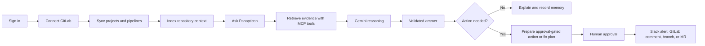
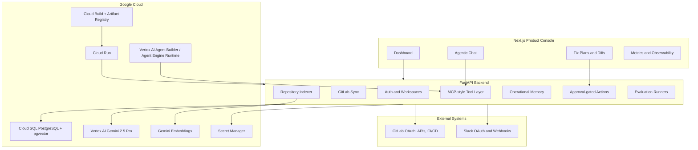

# Panopticon

[](#architecture)
[](#architecture)
[](#google-cloud)
[](#agentic-workflow)
[](#safety-model)

Panopticon is an agentic GitLab operations copilot that explains CI/CD failures, learns repository context, and drafts approval-gated fixes across GitLab and Slack.

Live app:

```text
https://panopticon-frontend-226094931757.us-central1.run.app
```

Backend API:

```text
https://panopticon-backend-226094931757.us-central1.run.app
```

## Why Panopticon Exists

When a deployment fails, the evidence is usually scattered:

- GitLab has the merge request, commits, jobs, and pipeline status.
- Slack has the human incident conversation.
- The repository has the actual source of the configuration or code bug.
- Prior incidents and rejected fixes live in memory, docs, or someone's head.
- The developer has to connect all of that manually under time pressure.

Panopticon turns that workflow into a single agentic operations console.

It does not just ask an LLM to guess why CI failed. It syncs GitLab data, indexes repository files, stores operational memory, calls scoped tools, asks Gemini to reason over grounded evidence, validates the answer, and prepares safe actions that still require human approval.

```text
Goal: fewer blind CI/debugging loops, safer remediation, and faster incident understanding.
```

## What It Does

| Area | What Panopticon Does |
| --- | --- |
| GitLab intelligence | Syncs projects, merge requests, pipelines, jobs, failed traces, repository files, and code metadata. |
| Deployment risk | Scores risky merge requests and operational changes before they hit production. |
| Pipeline debugging | Explains failed pipelines using job data, repository context, prior memory, and Gemini reasoning. |
| Repository awareness | Indexes file trees, code chunks, symbols, config files, deployment files, and test files. |
| Agentic chat | Lets developers ask project, pipeline, incident, code, action, and memory questions in natural language. |
| Slack integration | Prepares Slack alerts and operational messages through safe dry-run/live controls. |
| Fix plans | Drafts code-change plans with file-level reasoning, diff previews, tests, and rollback notes. |
| Approval gates | Requires explicit approval before GitLab comments, Slack messages, branches, or merge requests are created. |
| Operational memory | Remembers prior failures, accepted/rejected actions, user preferences, and project-specific patterns. |

## Product Flow



## Architecture



## Agentic Workflow

Panopticon's agent loop is tool-first and evidence-first:

```text
1. Classify the user's intent.
2. Resolve workspace and project scope.
3. Retrieve GitLab, repository, memory, incident, and action context through MCP-style tools.
4. Build a grounded evidence pack.
5. Ask Gemini 2.5 Pro to reason over the evidence.
6. Validate the answer for safety, grounding, and unsupported claims.
7. Show the user the answer, table, checklist, diff, or fix plan.
8. Require approval before any external write.
9. Store useful memory for future questions.
```

### Model Context Protocol (MCP) Integration

Panopticon leverages the **Model Context Protocol (MCP)** to equip AI reasoning agents with native tool access to your GitLab workspace. By standardizing communication through an MCP server, the chatbot and remediation agents can query issues, inspect repository files, create commits, and trigger pipeline events securely and dynamically.
> [!NOTE]
> Integrating via MCP allows AI models (like Claude or Gemini) to interact directly with GitLab APIs using a standard, secure toolset, reducing integration overhead and enabling rich, multi-file code operations.

### MCP-Style Tools

The backend exposes workspace-scoped tools for the agent runtime and chat layer:

| Tool Category | Examples |
| --- | --- |
| Project tools | `search_projects`, `get_project_summary`, `get_priority_context` |
| Pipeline tools | `get_pipeline_context`, `refresh_pipeline_job_traces` |
| Repository tools | `list_project_tree`, `read_repo_file`, `read_repo_file_range`, `search_code`, `grep_code`, `get_symbols`, `build_context_pack` |
| Memory tools | `get_memory_context` |
| Recommendation tools | `generate_grounded_recommendation`, `prepare_actions` |
| Fix tools | `draft_patch`, `create_fix_plan`, `get_fix_plans` |
| Observability tools | `get_observability_context`, `ingest_observability_event` |
| Metrics tools | `get_metrics_context`, `refresh_metric_snapshots` |

The managed agent does not directly receive database credentials, GitLab tokens, or Slack tokens. It calls Panopticon's backend tools, and the backend enforces workspace scoping, permissions, approvals, and audit logging.

## Safety Model

Panopticon is intentionally approval-gated.

| Risk | Control |
| --- | --- |
| Agent posts to Slack without permission | Slack actions are proposed first and require approval before live execution. |
| Agent comments on GitLab without permission | GitLab comments are dry-run or approval-gated. |
| Agent writes to default branch | Fix flow creates branches/MRs only after approval; no default-branch writes. |
| Agent leaks secrets from logs or files | Redaction and output validation block secret-like values. |
| Agent hallucinates root causes | Answers are validated against retrieved evidence and must admit uncertainty when evidence is missing. |
| Agent crosses tenant boundaries | Every data path is workspace-scoped and tested for isolation. |
| Stale memory overrides fresh facts | Memory is evidence-linked and never stronger than current GitLab/repository context. |

## Google Cloud

Panopticon uses Google Cloud as the production platform:

| Google Cloud Product | Role |
| --- | --- |
| Cloud Run | Hosts the FastAPI backend and Next.js frontend. |
| Cloud SQL for PostgreSQL | Stores users, workspaces, GitLab state, repo context, memory, actions, fix plans, metrics, and audit records. |
| pgvector / vector support | Enables production semantic retrieval over repository chunks. |
| Vertex AI Gemini 2.5 Pro | Powers live grounded reasoning. |
| Gemini embeddings | Embeds repository chunks for semantic code retrieval. |
| Vertex AI Agent Builder / Agent Engine compatible runtime | Packages Panopticon as a managed agent that calls backend MCP tools. |
| Secret Manager | Stores production secrets and OAuth credentials. |
| Cloud Build | Builds backend/frontend containers. |
| Artifact Registry | Stores production container images. |
| IAM service accounts | Controls least-privilege runtime access. |
| Cloud Logging | Supports production debugging and deployment verification. |

## Metrics And Validation

Current validation artifacts:

| Validation Area | Result |
| --- | ---: |
| Chat evaluation cases | 119/119 passing |
| Chat eval pass rate | 100.0% |
| Chat eval average latency | 51.9 ms |
| Chat eval p95 latency | 130.1 ms |
| Code patch evaluation cases | 500/500 passing |
| Code patch eval pass rate | 100.0% |
| Code patch eval p95 latency | 0.2 ms |
| Backend test suite | 127 tests passing |
| Live actions without approval | 0 by design |

Evaluation reports:

```text
artifacts/chat_eval/latest.md
artifacts/chat_eval/latest.json
artifacts/code_patch_eval/latest.md
artifacts/code_patch_eval/latest.json
```

The chat evaluation suite covers pipeline questions, deployment risk, incidents, memory, fix plans, approvals, formatting, missing evidence, onboarding, security, and ambiguous multi-project prompts.

The code patch evaluation suite covers Python fixes, TypeScript validation, CI timeout changes, deployment configuration, logging, retry robustness, JSON configuration, and test-note generation.

## Repository Layout

```text
backend/                 FastAPI API, GitLab/Slack integrations, memory, actions, fix plans
frontend/                Next.js product console and landing page
panopticon_agent/         Vertex AI Agent Builder / Agent Engine compatible runtime
prompts/                 Prompt templates for pipeline, incident, and risk reasoning
docs/                    Architecture, production, OAuth, roadmap, and evaluation docs
artifacts/               Generated evaluation reports
infrastructure/          Docker Compose and Cloud Run manifests
scripts/                 Cloud, smoke-test, and agent-runtime helper scripts
workflows/               Demo payloads and replay workflows
```

## Tech Stack

| Layer | Technology |
| --- | --- |
| Backend | Python, FastAPI, Uvicorn, SQLAlchemy, Alembic |
| Database | PostgreSQL, Cloud SQL, pgvector, local SQLite/PostgreSQL for development |
| Frontend | Next.js 16, React 19, TypeScript, Tailwind CSS, lucide-react |
| Agent runtime | Gemini 2.5 Pro, Gemini embeddings, MCP-style JSON-RPC tools, Vertex AI Agent Builder compatible runtime |
| Integrations | GitLab OAuth/API/CI/CD, Slack OAuth/webhooks |
| Cloud | Cloud Run, Cloud SQL, Cloud Build, Artifact Registry, Secret Manager, Vertex AI |
| Testing | pytest, chat eval runner, code patch eval runner, smoke scripts |

## Local Development

Run from PowerShell.

### Restart Everything

This clears common ports, runs migrations, starts backend and frontend, and writes logs to `logs/`.

```powershell
cd C:\Users\LENOVO\Downloads\Panopticon
.\scripts\restart_local.ps1
```

Open:

```text
http://localhost:3000
```

### Backend

```powershell
$ports = @(8000); foreach ($port in $ports) { $pids = (Get-NetTCPConnection -LocalPort $port -ErrorAction SilentlyContinue).OwningProcess | Select-Object -Unique; foreach ($pid in $pids) { if ($pid) { taskkill /PID $pid /F } } }

cd C:\Users\LENOVO\Downloads\Panopticon\backend
python -m alembic upgrade head
python -m uvicorn app.main:app --reload --host 127.0.0.1 --port 8000
```

### Frontend

```powershell
$ports = @(3000,3001); foreach ($port in $ports) { $pids = (Get-NetTCPConnection -LocalPort $port -ErrorAction SilentlyContinue).OwningProcess | Select-Object -Unique; foreach ($pid in $pids) { if ($pid) { taskkill /PID $pid /F } } }

cd C:\Users\LENOVO\Downloads\Panopticon\frontend
npm.cmd run dev
```

## Environment

Copy the backend example and fill real values:

```powershell
cd C:\Users\LENOVO\Downloads\Panopticon\backend
copy .env.example .env
```

Important production values include:

| Variable | Purpose |
| --- | --- |
| `DATABASE_URL` | PostgreSQL or Cloud SQL connection string. |
| `AUTH_REQUIRED` | Enables production authentication. |
| `CSRF_REQUIRED` | Requires CSRF tokens for browser state-changing requests. |
| `APP_PUBLIC_URL` | Frontend URL used after OAuth callbacks. |
| `ALLOWED_ORIGINS` | CORS allowlist. |
| `GITLAB_CLIENT_ID` / `GITLAB_CLIENT_SECRET` | GitLab OAuth. |
| `SLACK_CLIENT_ID` / `SLACK_CLIENT_SECRET` | Slack OAuth. |
| `GOOGLE_CLIENT_ID` / `GOOGLE_CLIENT_SECRET` | Google OAuth login. |
| `GOOGLE_CLOUD_PROJECT` | Google Cloud project, currently `panopticon-495816`. |
| `GOOGLE_GENAI_USE_VERTEXAI` | Enables Vertex AI Gemini usage. |
| `GEMINI_MODEL` | Gemini model, currently `gemini-2.5-pro`. |
| `REPO_EMBEDDING_PROVIDER` | Repository embedding provider, `vertex` for production. |
| `REPO_EMBEDDING_MODEL` | Embedding model, currently `gemini-embedding-001`. |
| `DRY_RUN_ACTIONS` | Keeps external actions safe while testing. |

More setup details:

```text
docs/PRODUCTION_SETUP.md
docs/PRODUCTION_OAUTH_REDIRECTS.md
docs/CLOUD_SQL_MIGRATION.md
docs/USER_SETUP_CHECKLIST.md
```

## Production Deployment

Production URLs:

```text
Frontend:
https://panopticon-frontend-226094931757.us-central1.run.app

Backend:
https://panopticon-backend-226094931757.us-central1.run.app
```

OAuth callback URLs:

```text
Google:
https://panopticon-backend-226094931757.us-central1.run.app/api/auth/google/callback

GitLab:
https://panopticon-backend-226094931757.us-central1.run.app/api/integrations/gitlab/callback

Slack:
https://panopticon-backend-226094931757.us-central1.run.app/api/integrations/slack/callback
```

Cloud Run services:

```text
panopticon-backend
panopticon-frontend
```

## Testing

### Backend Tests

```powershell
cd C:\Users\LENOVO\Downloads\Panopticon\backend
$env:AUTH_REQUIRED='false'; $env:CSRF_REQUIRED='false'; python -m pytest -q
```

Latest verified result:

```text
127 passed
```

### Frontend Build

```powershell
cd C:\Users\LENOVO\Downloads\Panopticon\frontend
npm.cmd run build
```

### Chat Evaluation

```powershell
cd C:\Users\LENOVO\Downloads\Panopticon\backend
python -m app.scripts.run_chat_eval --seed-showcase
```

Latest verified result:

```text
119/119 passing
p95 latency: 130.1 ms
```

### Code Patch Evaluation

```powershell
cd C:\Users\LENOVO\Downloads\Panopticon\backend
python -m app.scripts.run_code_patch_eval
```

Latest verified result:

```text
500/500 passing
p95 latency: 0.2 ms
```

### Agent Runtime Smoke Test

```powershell
cd C:\Users\LENOVO\Downloads\Panopticon
python scripts/smoke_agent_runtime.py --list-tools
python scripts/smoke_agent_runtime.py --question "Which risks should I inspect first?"
```

## Demo Story

Use this flow when presenting Panopticon:

1. Open the landing page and explain the problem: delivery data is scattered across GitLab, Slack, CI logs, and code.
2. Sign in with Google.
3. Connect GitLab and Slack.
4. Sync projects.
5. Open the dashboard and show high-risk projects, failed pipelines, blocked MRs, incidents, and pending approvals.
6. Open Chat and ask:

```text
Make a table of every failing area, what file caused it, why it failed, and what code change Panopticon should make.
```

7. Show that the answer uses repository context, not only job traces.
8. Open Fix Plans and show the file-level patch preview.
9. Emphasize that live Slack/GitLab actions require approval.
10. Show the evaluation metrics to prove the behavior is repeatable.

## Example Questions

```text
Which risks or failures should I inspect first?
Why did the latest pipeline fail?
Make a table of every failing area and what code change should fix it.
Which files are related to checkout authentication?
Draft a fix plan for this failed deployment.
Prepare a Slack alert, but do not send it yet.
Has this failure happened before?
What would make this project more robust?
```

## Roadmap

| Phase | Status |
| --- | --- |
| GitLab sync and dashboard | Implemented |
| Slack integration and dry-run actions | Implemented |
| Google OAuth and workspace auth | Implemented |
| Repository indexing and code retrieval | Implemented |
| MCP-style tool layer | Implemented |
| Vertex AI Gemini reasoning | Implemented |
| Agent Builder compatible runtime | Implemented |
| Chat eval and code patch eval | Implemented |
| Cloud Run deployment | Implemented |
| Deeper production observability | Next |
| Larger eval suites and live-code MR workflows | Next |

## Project Philosophy

Panopticon is built around one idea:

```text
An operations agent should be powerful enough to help, but constrained enough to trust.
```

The agent can read context, explain failures, remember patterns, draft fixes, and prepare external actions. But the human stays in control of writes, approvals, branches, merge requests, and live communication.

That is the difference between a chatbot demo and a production-grade agentic developer tool.

## License

This product has been licensed under the **Apache-2.0 License**. For further details, Please view the `LICENSE` file.
